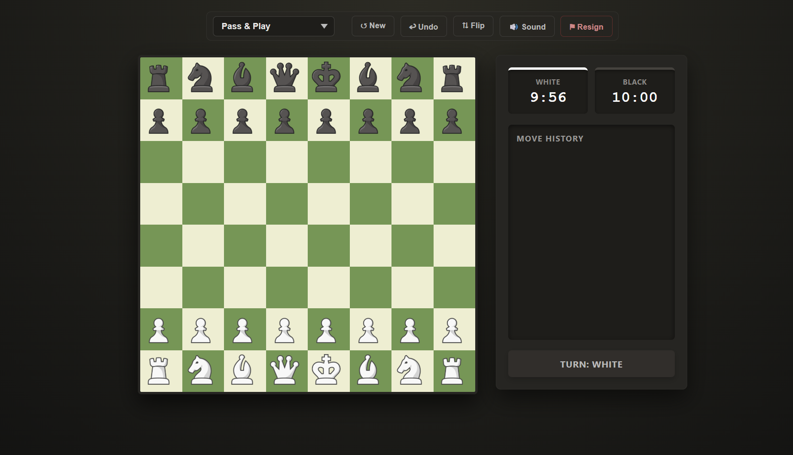

#  ChessHub

A fully playable, full-stack chess platform built with **Vanilla JavaScript, Node.js, Socket.IO, and MongoDB**. 

**ChessHub** features real-time online multiplayer, secure JWT authentication, and a robust ELO ranking system.



---

## 🚀 Live Demo

**[▶ Play the live game here](https://your-live-link.com)** *(Note: Update with your deployed backend link!)*

---

## ✨ Features

- **Real-Time Online Multiplayer** — Play against friends in real-time across the internet using Socket.IO.
- **Server-Authoritative Game Logic** — Uses `chess.js` on the Node.js backend to validate all moves, preventing cheating and guaranteeing accurate checkmate/draw detection.
- **ELO Rating System** — Track your progress globally! Winning games increases your ELO, and the server calculates official rating adjustments exactly like real chess platforms.
- **Secure Authentication** — Sign up and log in securely. Passwords are encrypted with `bcryptjs`, and WebSockets are authenticated using JSON Web Tokens (JWT).
- **Match Reconnect** — The server securely stores the board state (FEN) in MongoDB. If you accidentally close your tab or refresh, you can instantly rejoin your match exactly where you left off.
- **Custom AI Opponent** — Prefer to play solo? Challenge the built-in AI powered by the **Minimax algorithm with Alpha-Beta Pruning** across 4 difficulty levels.
- **Full Chess Rules** — Castling, en passant, pawn promotion, and draw conditions (Stalemate, 50-move rule, threefold repetition).
- **Quality of Life** — Standard Algebraic Notation (SAN) move history, live 10-minute chess clocks, board flipping, and Web Audio API sound effects.

---

## 🤖 How the AI Works

The AI uses the **Minimax algorithm**, a classic decision-tree search used in game theory, optimised with **Alpha-Beta Pruning**.

At each turn, the AI builds a tree of all possible moves up to a fixed depth (up to 4-ply lookahead). It assumes the human will always pick the move that maximises their score, and the AI will pick the move that minimises it. 

Positions are evaluated based on material value (Pawn=100, Queen=900, etc.) and Piece-Square Tables (PST) which give positional bonuses for controlling the centre or advancing pawns.

---

## 🛠️ Tech Stack

### Frontend
- HTML5, CSS3, Vanilla JavaScript (No frameworks)
- Web Audio API (for sound effects)
- Web Workers (for running the AI without blocking the UI)

### Backend
- **Node.js & Express** — REST API for authentication
- **Socket.IO** — Real-time bidirectional event-based communication
- **MongoDB & Mongoose** — Persists user stats, ELO, and active match states
- **chess.js** — Headless chess engine for server-side rule validation
- **JWT & bcryptjs** — Security and authentication

---

## 💻 How to Run Locally

1. **Clone the repo:**
   ```bash
   git clone https://github.com/DivyAgarwal1/chesshub.git
   cd chesshub
   ```

2. **Install dependencies:**
   ```bash
   npm install
   ```

3. **Set up MongoDB:**
   Make sure you have MongoDB installed and running locally on port `27017` (or provide a MongoDB Atlas URI in an `.env` file as `MONGODB_URI`).

4. **Start the server:**
   ```bash
   npm run dev
   # or
   npm start
   ```

5. **Open in browser:**
   Navigate to `http://localhost:3000`

---

## 🔮 What's Next?

- [ ] Chat system for multiplayer rooms
- [ ] Global Leaderboard page showing top ELO players
- [ ] Opening book (common openings database) for the AI
- [ ] Mobile-responsive touch support

---

## 👤 Author

**Divy Agarwal** — 3rd Year B.Tech Student  
👉 [LinkedIn](https://www.linkedin.com/in/divy-agarwal-066131319/) · [GitHub](https://github.com/DivyAgarwal1)

---

## 📄 License

MIT — free to use, modify, and distribute.